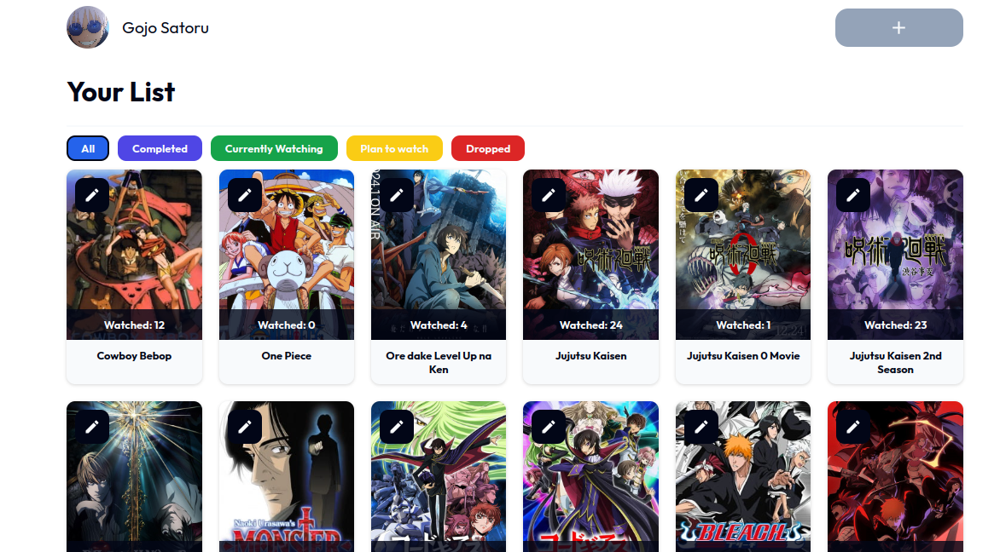

# anime-library

A project made for The Odin Project using the Jikan.moe API

Features:
- You can search for any anime
- You can add it to your list and it will be saved in the browser storage
- You can edit each entry: modify episodes and category

TODO:
- Fix edit panel
- Add option to remove entries from the list
- Be able to edit the number of episodes that you watched on currently airing anime
- Make the code cleaner
- Implement cloud storage with firebase 
